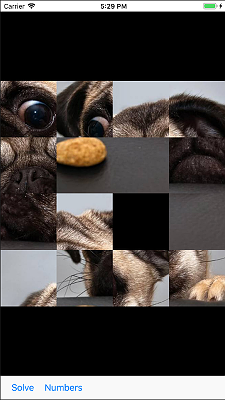
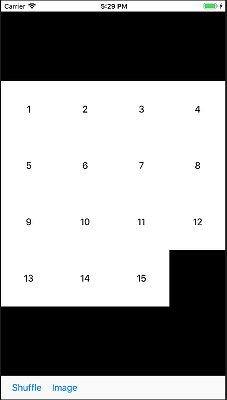

# 15 Puzzle
## WSU Vancouver - CS458 - Project 1
### First Swift Project
### Screenshots

### Abstract
[15 Puzzle](https://en.wikipedia.org/wiki/15_puzzle) is a sliding puzzle that consists of a frame of numbered square tiles in random order with one tile missing.  This project was to build familiarity with XCode and the Swift Programming Language.  Specifically, we used the Interface Builder (IB) editor to layout view components, MVC design and flow of events for a Single View Application.

More information is in the **/docs** [pdf.](docs/15puzzle.pdf)
### Testbed
Built and simulated on a *MacOS Sierra 10.12.6*, *XCode 9.2 (9C40b)* compiler and tested on *Simulator v10.0*.
### Extra Features beyond Assignment Guidelines
 - App icons for all sizes *(except for app store).*
 - Added Images for the 15 puzzle.
 - Shuffle button alternated to Solve button.
 - Allows alternating between images and numbers for puzzle solve.
 - Solved puzzle presents animation of the whole screen doing a barrel roll.
### Note
All code licenced MIT with exception to Apple comments and boilerplate code.

Image owned by proper copyright holder and is used for demonstration purposes only.

School assignment copyrighted by Instructor.
